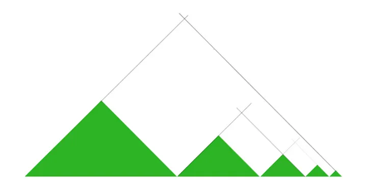
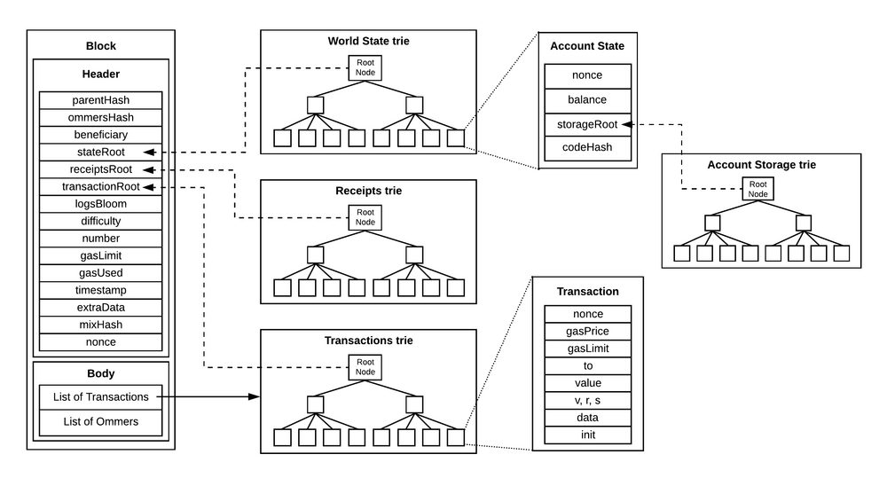

Merkle Mountain Range (MMR) is a friend of the Merkle tree and a spatially efficient data structure that allows large data sets to be stored and validated efficiently
In image, it can be thought of as a list of Merkle trees. The elements of the list (each green mountain) are the MMR itself, as shown in the diagram below

Although it appears similar to the data structure in Ethereum, where the root of the account storage trie fits into the leaf of the world state trie, MMR differs in that all Merkle trees are aggregated into a single Root. In other words, in MMR, each Merkle tree is similar to a sibling relationship rather than a parent-child relationship.
Incidentally, the root of the entire MMR is called peak, after the mountain.

