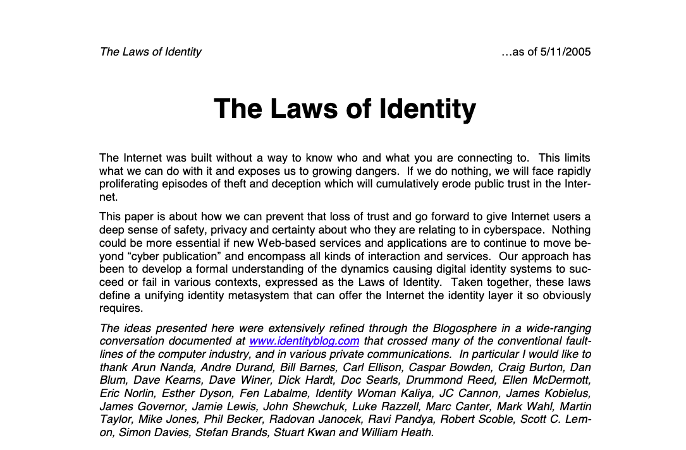
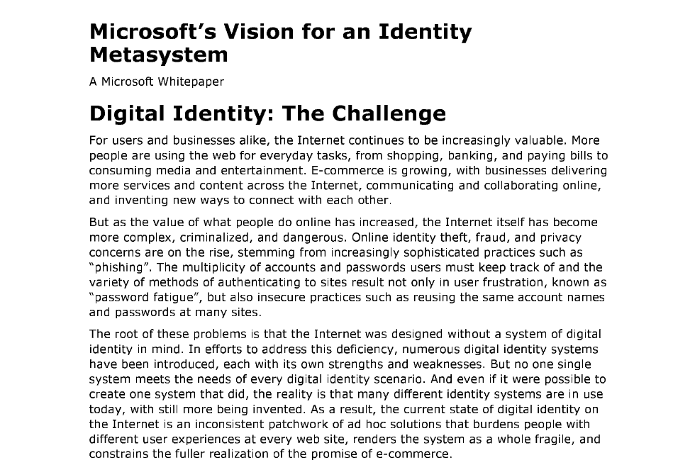

## Introduction

In 2005, an era when the internet was still in its dawn. [Kim Cameron](https://en.wikipedia.org/wiki/Kim_S._Cameron), an identity architect at Microsoft, foresaw the future of digital identity.

"The Laws of Identity" he proposed are still an important guideline for digital society 20 years later.

Cameron actively continued to promote the laws of user-centric identity, laws that allow users to control their own digital identity. He also spoke out about the widespread misuse of identity and the risks to privacy and autonomy posed by web technologies.

The Laws of Identity sharply point out a fundamental flaw in the internet. A network built without an identity foundation faces three crises: security, privacy, and trust. Cameron proposed **the laws of digital identity** to overcome this crisis. He argued that by following these, it is possible to build the necessary **identity metasystem** for the internet and establish security, privacy, and trust.

This article reinterprets Cameron's vision in a modern context and explores how digital identity has evolved over the past 20 years and the challenges it still faces today.

I pay tribute to Kim Cameron, who passed away in 2021, as a visionary of digital society.

## 2005

This was the year the internet began to spread to homes and the first video was posted on YouTube.
In the midst of this, Cameron stated in The Laws of Identity that "the internet was built without a way to know who and what you are connecting to, forcing service providers to each devise their own workarounds." He also criticized the internet of today as a "patchwork of identity" as a result.

This caused the following serious challenges:

- Trained Ignorant Users: Hundreds of millions of users have been conditioned to believe that entering their name, a secret password, and personally identifiable information into almost every input form is the "normal way" to do business online. Without a consistent, understandable framework for evaluating the authenticity of the sites they visit, and without a reliable way to know if they are disclosing private information to fraudulent parties.

- Increase and Professionalization of Crime: As people manage and exchange more valuable things on the internet, criminal organizations that understand the ad-hoc and fragile nature of the identity patchwork and exploit it are increasing. Incidents of personal information being stolen through methods like phishing and pharming, and hundreds of thousands of identities being stolen at once from databases of companies, governments, and educational institutions, have also occurred.

- Decline in Trust and Obstruction of Economic Activity: The ad-hoc nature of the identity patchwork cannot withstand the increasing attacks from professionalized attackers. This kind of serious public crisis means that the internet is beginning to lose its trustworthiness and acceptability in economic transactions.

- Limitation of Web Service Potential: The lack of an identity layer is one of the major factors limiting the further development of web services. While web services are designed to build loosely coupled and flexible systems, as long as digital identity is still an ad-hoc, one-off patchwork that needs to be hardwired, the negotiation power and composability achieved in other aspects enable nothing new.

- Difficulty in Adding an Identity Layer: Building a rational identity fabric across the entire internet is difficult because there are numerous contexts where identity is needed. It is unreasonable to expect companies to view their relationships with customers and employees as important assets and to be restricted in their choices of how to build and represent digital relationships, or to relinquish control. Governments and specific industries (such as finance) also have their own needs.

- User Anxiety and Privacy Concerns: Consumer anxiety about internet safety prevents many people from using credit cards for online purchases. With the increase in malware and identity theft, privacy issues have become a top priority for all internet users.

These challenges still remain in our society 20 years later.

Microsoft, led by Cameron, believed that a single, simple digital identity solution was not realistic to overcome these challenges, and proposed an **identity metasystem** that weaves a single identity fabric from multiple constituent technologies.

## Identity Metasystem

![[Identity Metasystem.png]]
The identity metasystem is a system that provides the unified identity layer missing from the internet. It was proposed to solve the aforementioned identity patchwork problem.

This metasystem defines digital identity as "a set of claims that a digital subject makes about itself or another digital subject." This definition encompasses all existing digital identity systems and allows for a unified understanding of the metasystem concept, which includes multiple implementations and methods. It includes not only unique identifiers for indexing but also claims about attributes (age category, group membership, etc.) and capabilities. Importantly, the evaluation of the usefulness, truthfulness, and trustworthiness of these claims is left to the relying party.

By being built according to the laws of digital identity described later, the metasystem enables interoperability between various identity technologies and multiple identity providers. This is an approach that protects applications from the internal complexity of specific identity implementations and makes digital identity loosely coupled. It plays a similar role to device drivers and network sockets (TCP/IP) in the evolution of computing, which abstracted the complexity of hardware and networks.

Such claims and interoperability are at the core of the metasystem.

Furthermore, the metasystem is not a single centralized system but must enable interoperability between multiple identity technologies and multiple identity providers. This is because there are numerous contexts where identity is needed (citizen, employee, customer, etc.), and different types of identity systems are required in each context. Within the metasystem, different identity systems exist and cooperate with each other, allowing users to select the appropriate identity provider and functionality according to the context.

In short, the identity metasystem is a "system of systems" that provides an abstracted, unified interface on top of the diverse needs and existing patchwork of identity technologies, aiming to provide a reliable way to securely establish who is connecting to what at internet scale.

## The Laws of Identity

"The Laws of Identity" are objective hypotheses that define the dynamics by which digital identity systems succeed or fail in various contexts, and are seen as defining the architecture of the identity layer missing from the internet. By following these laws, an identity metasystem can be built to establish trust, privacy, and security.

![[NotebookLM Mind Map (1).png]]

### 1. User Control and Consent

First, technical identity systems must appeal through user convenience and simplicity, but to endure, they must above all gain user trust. The following requirements must be met:

- Information that identifies the user must only be disclosed with the user's consent.
- And the system must allow the user to control which digital identity to use and which information to disclose.

Furthermore, the following requirements are included to protect users from deception:
- Verifying the identity of the party requesting information.
- Ensuring there is no doubt that the information will reach the correct party.
- And providing a mechanism for the user to be aware of the purpose of information collection.

Additionally, the system must be strengthened to allow users to maintain a sense of control regardless of the context.

By following this law, the system gains user trust, and users can appropriately control their digital identity and the sharing of information. This forms the basis of security and privacy.

### 2. Minimal Disclosure for a Constrained Use

The second law comes from the idea that "the solution that discloses the least amount of identifying information and constrains its use the most is the most stable solution in the long run."

Systems built according to the law of information minimalism become less attractive targets for identity theft because less identifying information is less valuable, further reducing risk.
For example, the following configuration is desirable:
- Systems should be built on the premise that information leaks can always occur.
- To mitigate risk, information should only be obtained based on "need to know" and retained only based on "need to retain."

This minimizes damage in the event of a leak. Furthermore, it is recommended to use information that is unlikely to uniquely identify an individual across contexts (e.g., age category instead of date of birth). Context-specific unique identifiers (e.g., a randomly generated employee number) are less risky than unique identifiers that can be reused across other contexts, such as social security numbers.

Aggregation of identifying information also aggregates risk, so aggregation must be minimized to minimize risk. This law is essential for maximizing privacy and security.

### 3. Justifiable Parties

Some users will not want certain services to know everything about their internet activity. While it may be justifiable to use a government-issued identity for transactions with the government, whether using it for a family wiki or hobby-related activities is "necessary and justifiable" is a cultural and personal judgment.

- Digital identity systems must be designed so that the disclosure of identifying information is limited to parties who are in a necessary and justifiable position in a specific identity relationship.
- The system must allow the user to be aware of the party with whom they are sharing information.

This requirement of justification applies to both the user disclosing the information and the relying party.
This law enhances security by ensuring users are clearly aware of who they are sharing information with. It is also suggested that each party should provide a policy statement regarding information use, which should define "delegated rights."

### 4. Directed Identity

A universal identity system must support both "omni-directional" identifiers for public entities and "unidirectional" identifiers for private entities. This prevents the unnecessary emission of correlations between the two.

- Public entities (e.g., a company website) can have an "omni-directional" identifier like a "beacon" that reveals its existence to anyone.
- On the other hand, private entities (e.g., a consumer visiting a website) can establish a "unidirectional" identity relationship with that specific site by choosing a unique identifier to be used only with that site.

This law protects privacy by minimizing the risk of private entities' activities being tracked and aggregated.

### 5. Pluralism of Operators and Technologies

This law can ensure flexibility and scope to meet diverse needs and increase the overall acceptability of the system. It aims to avoid single points of failure and enable the evolution and self-organization of the identity ecosystem, with the following requirements:

- A universal identity system must enable interoperability between multiple identity technologies and multiple identity providers.
- There are numerous contexts where identity is needed, so a single centralized system cannot handle them.
- Different contexts (citizen, employee, customer, etc.) require different types of identity systems, and there must be identity systems that offer different (and potentially conflicting) characteristics for each.
- Therefore, within the identity metasystem, different identity systems must exist and cooperate with each other.

It is important to note that this is not just about different governments, companies, and individuals becoming identity providers, but also about the identity systems themselves having different characteristics.

### 6. Human Integration

The purpose of this law is to ensure security against attacks such as phishing and pharming by enabling users to accurately understand identity-related interactions and respond appropriately. It imposes the following requirements:

- A universal identity metasystem must define human users as components of a distributed system integrated through unambiguous human-machine communication mechanisms.
- This means not only protecting the encrypted channel between the server and the browser but also properly protecting the short channel between the browser's display and the human brain using it. Phishing and pharming attack this short channel.
- Identity information must be conveyed to the user in an easy-to-understand manner and provide a predictable and unambiguous user experience ("ceremony" of interaction). This is essential to prevent unintended consequences when deciding who you are talking to and which personally identifiable information to disclose.

It is also suggested that "trustworthiness" here can be objectively measured through user testing.

### 7. Consistent Experience Across Contexts

This refers to identity and UX, and has the following requirements:

- A unified identity metasystem must ensure a simple and consistent experience for the user while enabling context separation through multiple operators and technologies.
- Users must be able to understand their options and choose the best identity for the context.

Users are expected to have multiple digital identities for various contexts, such as browsing, personal relationships, communities, work, financial transactions, and citizenship. The initial assertion is that these digital identities should be "thingified" like icons or lists on a desktop, allowing users to visually recognize, add, delete, select, and share them.

Furthermore, by providing a consistent and clear user experience, users can effectively manage their multiple digital identities and appropriately control them according to the context. This is essential for maintaining user trust and for the system to be widely accepted.

## 2025

20 years later, have these laws been observed and has the patchwork improved?
Personally, I can glimpse these laws in many aspects of daily life, but with the emergence of new technologies, it seems that improvements have not kept pace.

In many current web services, users are asked to agree to a privacy policy before using the service. This is based on "1. User Control and Consent," but few users will read through all the documents. No, most users probably agree without reading. In other words, they remain "trained ignorant users."

Suppose you read and agree to the privacy policy. Next, you are faced with the service registration screen. Here, you are asked to provide a lot of personal information, from your phone number to your date of birth, making it difficult to achieve information minimalism.
This is understandable, as with the development of AI, it is a known fact that user data is more desirable for companies now than it was 20 years ago.

## 20xx

So what should digital identity be like on the internet of the next era?

First, I think the directed identity part needs to be revised. With the advent of social media, which did not exist at the time, people value connections with others, and many individuals have also become public entities. And they willingly expose their location, what they have purchased, their connections with people, and their families.

Looking further into the future, with the development of [BCI](https://en.wikipedia.org/wiki/Brain%E2%80%93computer_interface), "human integration" will also need to be redesigned. In this future, what is stolen in phishing attacks are assets like emotions, memories, and ideas, which are the core of privacy and identity.
Despite the fact that identity, once stolen, cannot be recovered, people living in a capitalist, competitive society are forced to choose convenience over security (privacy) in a trade-off.

However, it is also true that people are starting to realize the negative aspects of these technologies. The EU's GDPR initiative, particularly regarding data portability, seems to follow the laws of identity. Although there is a conflict between the US and the EU in the background, ironically, Cameron was an American, and the vision he envisioned transcends such conflicts.

Unlike technologies like AI, the underlying philosophy of blockchain is about individuals managing their own sovereignty and assets. In the Recent Presentations section of Cameron's blog, there is an archive titled "[The Laws of Identity on the Blockchain](https://www.identityblog.com/wp-content/resources/2018/eic2018_06_cameron.mp4 "— EIC Keynote May 2018. The Laws of Identity, embedded in the GDPR, will drive the adoption of Decentralized Identity anchored by Blockchain)"). In this presentation, a mechanism is proposed where individuals manage their own data through a decentralized system called an identity hub, while being based on blockchain technology but not directly storing personal information. The development of DID is related to this, and the identity metasystem is being inherited.
![[アイデンティティメタシステム - visual selection (4).svg]]

If we were to update the laws of identity to match the modern era, I would like to propose "[Inward Privacy Protection](https://x.com/adust09/status/1828413847738425526)" after reflecting these technologies.
This is an update to directed identity. Directed identity only defines how to establish relationships between individuals and companies, but here it provides a function for individuals to actively reject contact from companies.
Generally, privacy is thought of as "not giving information to others" or "maintaining anonymity," but that is only when considering outward privacy protection. However, it is also necessary to consider inward privacy, that is, controlling the information that comes into oneself.
If this is not possible, the sanctuary of the subconscious will be violated. Corporate marketing and the attention economy of social media are trying to enter in this way, which could be considered a violation of privacy.

For example, "advertisements" and "SNS recommendation functions" can be said to be violations of privacy in that companies are unilaterally stepping into one's cognition.
It is strange that one has to introduce ad blockers or pay for social media to avoid receiving these. Users should have the right to choose to receive information according to their own will, so why should they have to pay money?

## Conclusion

I pay tribute to Cameron's deep insights and influence, who advocated for the laws of user-centric identity throughout his career. The laws he proposed have become not just technical guidelines but a philosophical foundation for protecting individual sovereignty and freedom in the digital age. They have also been mentioned recently in Plurality and will likely become an important concept in realizing digital democracy.

Going forward, it will be important for each citizen to understand and embody Cameron's philosophy.

## References

- [Kim Cameron's Identity Weblog](https://www.identityblog.com/)
- [Design Rationale behind the Identity Metasystem Architecture](https://www.microsoft.com/en-us/research/wp-content/uploads/2017/05/Identity_Metasystem_Design_Rationale.pdf)
- [The Laws of Identity on the Blockchain](https://www.youtube.com/watch?v=F_vOQjTO6HI)
