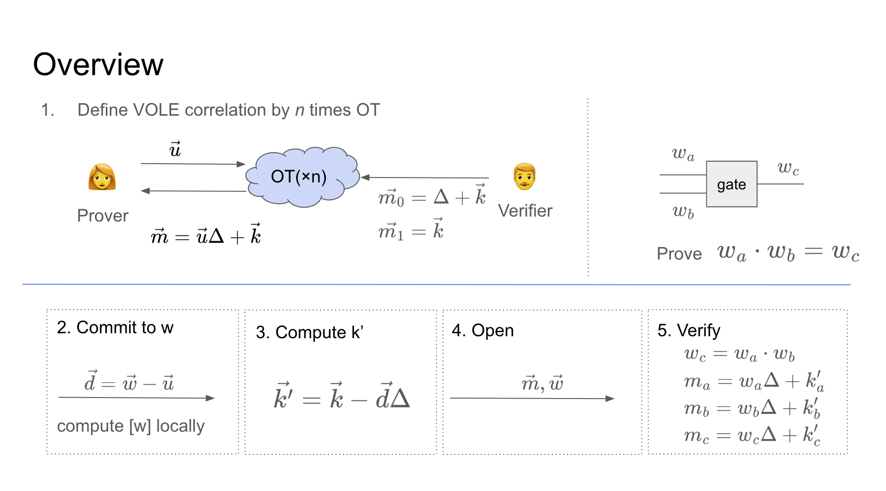

This blog will describe the Quicksilver configuration, known as an efficient VOLE-based ZK.
## 1. Pros/Cons
Not limited to Quicksilver, VOLE-based ZKs have the following characteristics

**Pros**
This is due to the benefit of efficient Commitment scheme by linear arithmetic and additive quasi-isomorphism.

- Fast proving
- Memory efficient
- Without trusted setup

**Cons**
Proof size increases linearly as vector size increases in proportion to Constraint.

- Linear proof size
- Interactive
- Designated verifier
- Communication cost

There are also communication challenges for OT-based protocols.
Fortunately, NIZK has been achieved in VOLE in the Head and is publicly verifiable.
Communication cost can be reduced to O(logn) by adopting Softspoken OT.
In other words, if we do not pay attention to the issue of proof size, we can say that it is at a practical stage.

This characteristic has attracted attention in the context of Client-side proving, zkTLS, and others.
Personally, I think it is also compatible with zkVM.

# 2. Commitment scheme

The VOLE Commitment scheme not only satisfies Hiding and Binding, but also has Additive Homomorphism.
This makes it possible to realize a lightweight Commitment scheme and efficiently generate Proofs even for large circuits.

**Hiding**
- As long as Prover keeps $k$ secret, Verifier cannot know $w$.

**Binding**
- As long as the Verifier keeps secret about the $\Delta$, the Prover cannot construct $m'$ using an illegal $w'$.

**Additive Homomorphism**
- Two Commitments can be added without having to calculate them separately.
- This property can be used in linear operations such as scalar products

Define $m_c=m_a+m_b, w_c=w_a+w_b, k_c=k_a+k_b$.
Then, the following equation holds.

$$m_a=w_a\Delta+k$$
$$m_b=w_b\Delta+k_b$$
$$m_c=w_c\Delta+k_c$$

Additive homomorphism can also be used for scalar products.

# 3. The Quicksilver Protocol

Quicksilver divides the VOLE correlations into a Preprocessing phase in which the VOLE correlations are calculated in advance, and an Online phase in which the VOLE correlations are actually Proofed & Verified.

## 3.1 Preprocessing phase

Prover and Verifier cooperate to generate the VOLE Correlation. As mentioned earlier, since $\Delta$ and $k$ are secret information, it is necessary to generate a VOLE Correlation while keeping each other's information hidden.
Therefore, information is exchanged using Oblivious Transfer. Here, the Sender is the Verifier and the Receiver is the Prover.

Prover generates a bit string $\vec{u}$ consisting of 0/1 and sends it to Verifier.
Verifier sends back $m_0=\Delta+\vec{k}$ and $m_1=\vec{k}$ according to the bit sequence.

By repeating this according to the length of vector, prover can generate $\vec{m}=\vec{u}\Delta+\vec{k}$.

## 3.2 Proving phase

Here, wire value:$w$ at each gate of Circuit is committed and opened using the VOLE Correlation obtained in the preprocessing phase. 1.

Prover sends $\vec{d}=\vec{w}-\vec{u}$ to Verifier and commits. 2.
Verifier calculates $\vec{k'}=\vec{k}-\vec{d}\Delta
Prover sends $\vec{m},\vec{w}$ to Verifier and makes Open commitment. 4.
Verifier calculates VOLE Correlation and verifies the proof.

$$
\begin{split}
\vec{m}&=\vec{w}\Delta+\vec{k'} \\
	&= \vec{w}\Delta+(\vec{k}-\vec{d}\Delta) \\
	&=(\vec{u}+\vec{d})\Delta+(\vec{k}-\vec{d}\Delta) \\
	&=\vec{u}\Delta+\vec{k}
\end{split}
$$

For example, when evaluating the following OR gate, i.e., when you want to prove that $w_a+w_b=w_c$.
 Verifier verifies that the following OLE holds,

$$
\begin{split}
m_a=w_a\Delta+k'_a \\
m_b=w_b\Delta+k'_b \\
m_c=w_c\Delta+k'_c \\
\end{split}
$$
Furthermore, from Additive Homomorphism, we verify that
$$
m_a+m_b=(w_a+w_b)\Delta+(k'_a+k'_b)=m_c
$$
Additive Homomorphism can be applied to linear operations such as scalar multiplication, but a challenge arises when trying to evaluate multiplication (AND gate).
However, this problem arises when trying to evaluate multiplication (AND gate), since the multiplication of two linear polynomials simply becomes a quadratic polynomial, which does not satisfy the VOLE Correlation.

What would be the best way to solve this? If possible, we would like to use Additive Homomorphism.
This can be solved by extending VOLE to VOPE (Vector Oblivious Polynomial Evaluation).
Prover computes the following $(A_0,A_1)$ using local values.

$$A_0=m_a\cdot m_b$$
$$A_1=w_a\cdot m_b+w_b\cdot m_a-m_c$$
Similarly, the verifier computes $B$.
$$B=k_a\cdot k_b-k_c\cdot \Delta$$

This calculation is composed by relying on Beaver Triple Multiplication.
Prover then sends $(A_0,A_1)$ to Verifier.
Verifier then verifies that $B=A_0+A_1\cdot\Delta$ is valid from the following calculation.

$$
\begin{split}
B&=k_a\cdot k_b-k_c\cdot\Delta \\
 &=(m_a+w_a\Delta)\cdot(m_b+w_b\Delta)-(m_c+w_c\cdot\Delta)\cdot\Delta \\
 &=m_am_b+m_aw_b\Delta+ w_am_b\Delta+w_aw_b\Delta^2-m_c\Delta-w_c\Delta^2 \\
 &=A_0+A_1\cdot \Delta+(w_a\cdot w_b-w_c)\cdot\Delta^2 \\
\end{split}
$$
If $w_a\cdot w_b=w_c$ holds, then the term $\Delta^2$ disappears and $B=A_0+A_1\cdot\Delta$
can be verified since $B=A_0+A_1\cdot\Delta$.

Strictly speaking, further elaboration is necessary to satisfy the zero-knowledge property, but this will be omitted.

# Refference

- https://eprint.iacr.org/2021/076.pdf
