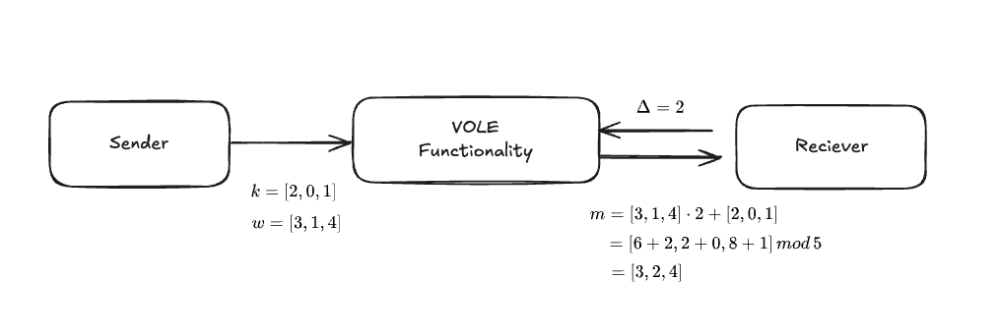
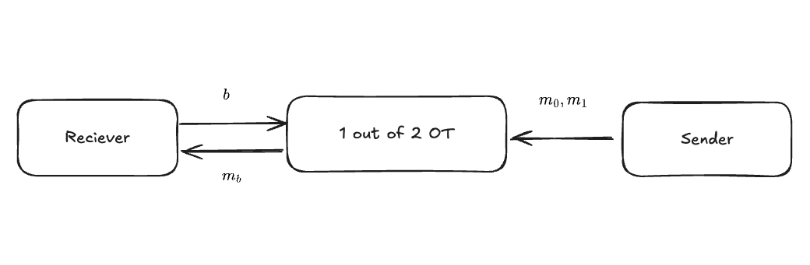
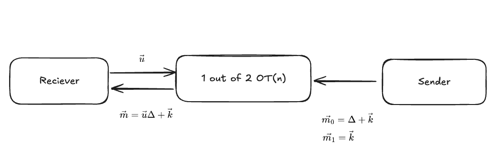

# What is the VOLE

VOLE(:Vector Oblivious Linear Evaluation) is a 2PC protocol that efficiently performs vector operations while maintaining confidentiality, and was proposed as an extension of OT(:Oblivious Transfer).
Recently, LPN-based Variant and hybrid models with OT have also been proposed.
In addition, since it does not use complex mathematical spaces such as elliptic curve cryptography, it is being studied for application not only in MPC but also in Zero-Knowledge Proof System.

|Years|Updates|Reference|
| ---- | ------------------------------------------------------- | -------------------------------------------------- |
| 2018 | LPN-based VOLE is proposed                                    | **[BCGI18](https://eprint.iacr.org/2019/273)**     |
| 2019 | Pseudorandom Correlation Generators enable efficient VOLE composition | **[BCGI19](https://eprint.iacr.org/2019/448)**     |
| 2021 | VOLE-based ZK is proposed                                        | **[WYKW21](https://eprint.iacr.org/2020/925.pdf)** |
| 2023 | Public verifiable and NIZK VOLE-based ZK is proposed                | **[BBDG23](https://eprint.iacr.org/2023/996)**     |

Let's start with a black box description of how VOLE is configured and explain the whole process.
In VOLE, the sender and receiver evaluate the following relational equation, each holding a unique secret value
$$\vec{m}=\vec{w}\Delta+\vec{k}$$
>Note, however, that the notation and the role of Vector here is with VOLE-based ZK in mind, and is not the case with respect to MPC and the like.

Sender.
- $\vec{w}\in{F^n_p}$: Vector of secret values
- $\vec{k}\in{F^n_p}$: random vector for Hiding

Receiver
- $\Delta\in{F_p}$: secret scalar value chosen by the verifier
- $\vec{m}\in{F^n_p}$: operation result received by the verifier

The following is an example for p=5, n=3.

So what exactly is the composition of VOLE Functionality as a black box?
The motivation for VOLE Functionality is that we want to construct a correlation while keeping our information hidden. To achieve this cryptographically, Oblivious Transfer can be used.

>Although there are methods to configure VOLE based on LPN (Learning Parity with Noise) and hybrid models that combine LPN and OT, this section describes a simple OT model.

Oblivious Transfer is a building block in the Garbled Circuit, a type of MPC construction method.
This is a protocol in which a Sender has two messages and sends the one selected by the Receiver. However, the Sender cannot know which message was selected, and the Receiver cannot obtain the message that was not selected.
Specifically, it is designed based on public key cryptography, and the Sender sends a message according to the bit (0/1) selected.

This is used in VOLE as follows.

Since only one message can be sent in a basic OT, constructing an n-vector VOLE requires repeating n OTs, so the communication cost increases linearly with the length of the vector. Fortunately, 1-out-of2 OTs can be extended to k-out-of n OTs, and the communication cost can be dropped to O(log n).
